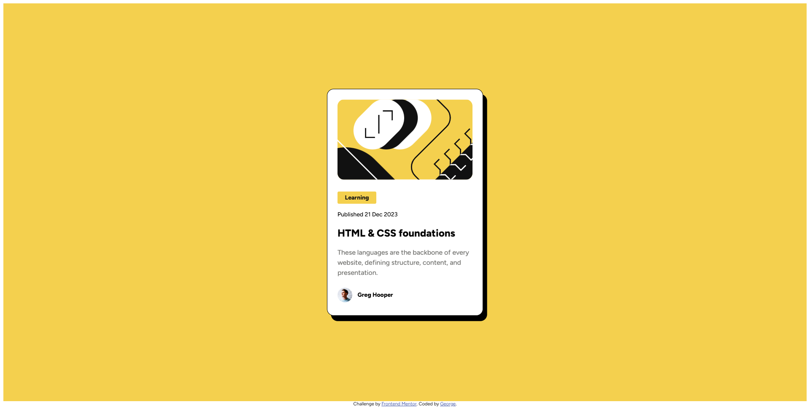

# Frontend Mentor - Blog preview card solution

This is a solution to the [Blog preview card challenge on Frontend Mentor](https://www.frontendmentor.io/challenges/blog-preview-card-ckPaj01IcS). Frontend Mentor challenges help you improve your coding skills by building realistic projects. 

## Table of contents

- [Overview](#overview)
  - [The challenge](#the-challenge)
  - [Screenshot](#screenshot)
  - [Links](#links)
- [My process](#my-process)
  - [Built with](#built-with)
  - [What I learned](#what-i-learned)
  - [Useful resources](#useful-resources)

**Note: Delete this note and update the table of contents based on what sections you keep.**

## Overview

### The challenge

Users should be able to:

- See hover and focus states for all interactive elements on the page

### Screenshot

    

### Links

- Deployed URL: [GitHub Pages link](https://georgeburn94.github.io/blog_preview_challenge/)

## My process

### Built with

- Semantic HTML5 markup
- CSS custom properties
- Flexbox
- Mobile-first workflow

### What I learned

In this session, I got a solid refresher on Flexbox and how it makes creating responsive layouts way easier—just by aligning and spacing items within a container. I also picked up a handy tip: using padding around images can be simpler and more reliable than messing with margins, especially when you want to avoid spacing issues. Plus, I learned how to switch up cursor states, like turning the cursor into a pointer when hovering over buttons or links, which is a small but cool way to make a site feel more interactive. Overall, these tricks are making my designs cleaner and more user-friendly!

I also worked with a Figma design file for the first time, translating it into code, which gave me a more realistic workflow and helped me understand how to bridge the gap between design and development.

### Useful resources

- [Flexbox Froggy](https://www.flexboxfroggy.com) - Used this for a quick refresher on getting items aligned with Flexbox.

## Author

- LinkedIn - [@GeorgeBurn94](https://www.linkedin.com/georgeburn94)
- Frontend Mentor - [@GeorgeBurn94](https://www.frontendmentor.io/profile/Georgeburn94)

